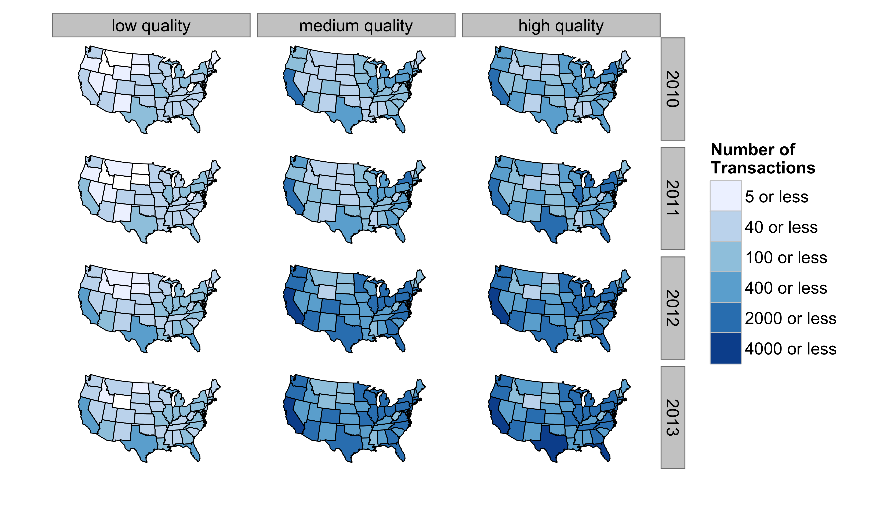
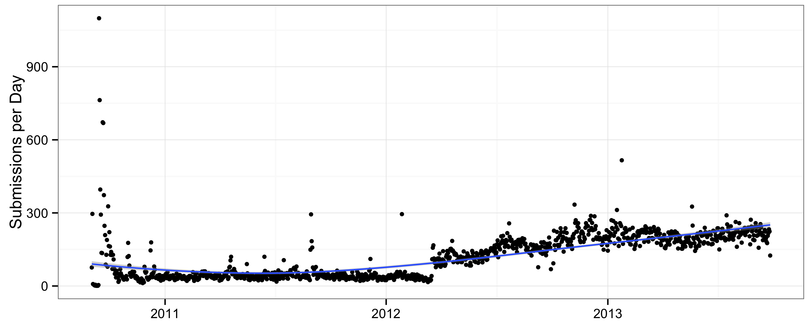

Data from the [priceofweed.com](http://priceofweed.com), from September 2nd, 2010 to September 26, 2013. The data are no longer accessible online (I've left the scraper here in case that changes). The data have been cleaned and geo-coded. The raw data have 169,742 entries and the cleaned data have 133,454 entries. Each entry (in the raw data) has the folowing fields: `location` (automatically coded based on IP), `price`, `amount`, `quality`, and `date` (automatically recorded). The dependencies for the scraper are listed in `requirements.txt` and the dependencies for the data cleaning and plotting scripts are listed at the top of each script.

